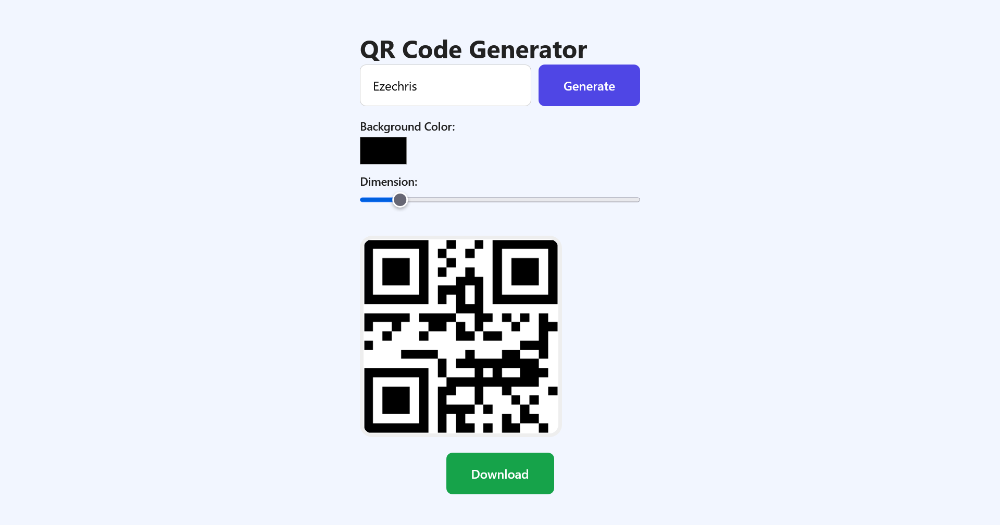

# QR Code Generator

A simple React application that allows users to generate QR codes based on any text input.



## ✨ Features
- Enter text and generate a QR code instantly.
- Change the background color of the QR code.
- Adjust the QR code size using a slider.
- Download the generated QR code as an image.

## 🛠️ Tech Stack
- **React** – UI and state management.
- **SCSS** – Styling with modular and clean structure.
- **[QRServer API](https://api.qrserver.com/v1/create-qr-code/)** – External API to generate QR codes dynamically.

## 🎨 Styling
The project uses **SCSS** for styling, providing a maintainable and scalable approach to writing CSS.  
SCSS allows for nesting, variables, and better organization of styles.

## 🚀 Getting Started

Clone the repository and install dependencies:

```bash
git clone https://github.com/ezechrissampson/qrcode-generator.git
cd qrcode-generator
npm install

